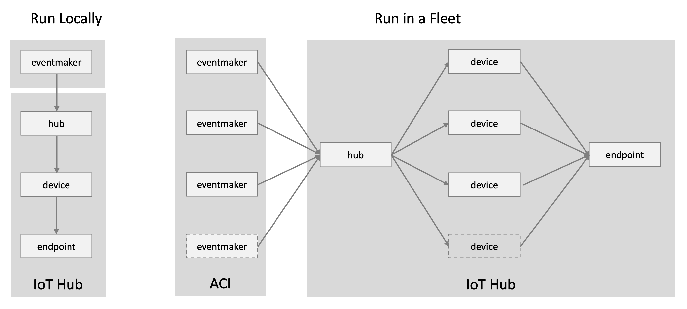
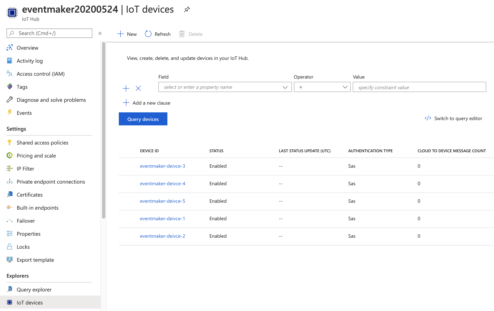
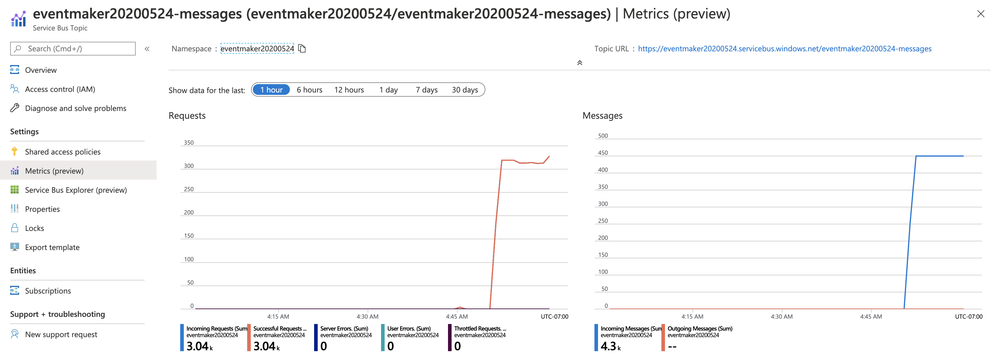
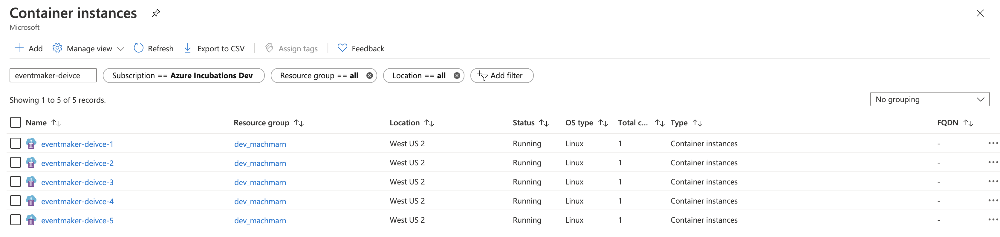
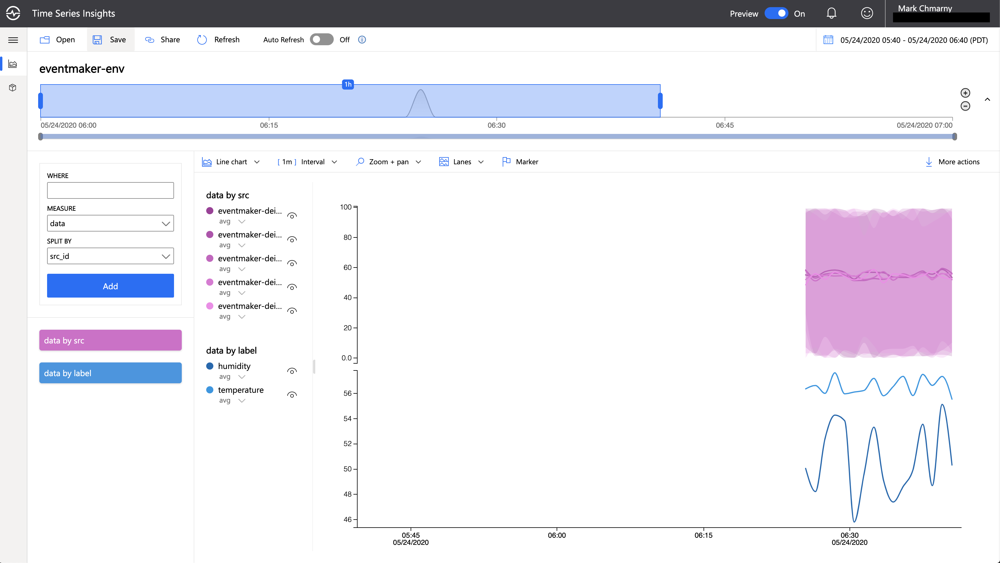

# eventmaker

Utility to mock IoT events. It configures Azure IoT Hub with devices and launches a fleet of virtual devices that send mocked events to the hub.



## setup

To run `eventmaker` start by editing a couple variable in the [script/config](script/config) file:

```shell
HUB_NAME="eventmaker20200523"
NUMBER_OF_DEVICES=3
METRIC_CONFIG="https://raw.githubusercontent.com/mchmarny/eventmaker/master/config/thermostat.yaml"
```

* `HUB_NAME` - name of the Azure IoT Hub that will be created. Has to be unique globally. 
* `NUMBER_OF_DEVICES` - number of devices that will be created in the IoT Hub and number of virtual devices that will be created in ACI to generate events
* `METRIC_CONFIG` is either path or a URL to metric configuration file

YOu can calibrate the total number of events by combining the number of devices, and the frequency of event metrics (e.g. 10 devices generating 2 metrics every 1 second equal 1,200 events a minute) 

## hub

> assumes you have subscription id, resource group and location defaults set 

To create an IoT Hub with a custom message route draining to a new Service Bus topic run `hub-up`  (execution time: ~5 min)

```shell
bin/hub-up
```

When completed, the final message will read "IoT Hub configuration done"

## fleet 

Now that the IoT Hub is up, you can deploy the fleet of devices with a corresponding Azure Container Instances service to mock events and send them 

```shell
bin/fleet-up
```

> The deployment is asynchronous so if you want to see the result open the ACI dashboard in Azure Portal. Note, may take a ~30 seconds for the first image to appear in the UI

## events 

The mocked event generated by each device in the fleet will look like this

```json
{
    "id": "fdf612b9-34a5-445e-9941-59c404ea9bef",
    "src_id": "device-1",
    "time": 1589745397,
    "label": "temp",
    "data": 70.79129651786347,
    "unit": "celsius"
}
```

The `src_id` will be unique to every device and the event `id` will be set to a globally unique ID

## metrics 

`eventmaker` supports dynamic metric configuration. That means that you can create new type of event by defining it's label and frequency along with the type and range of value each metric should generate in a file. That file can be local (e.g. `--file config/example.yaml`) or loaded from a remote URL (e.g. `--file https://raw.githubusercontent.com/mchmarny/eventmaker/master/config/thermostat.yaml`). The example bellow defines thermostat metrics (temp and humidity)

```yaml
--- 
metrics: 
- label: temperature
  frequency: "1s"
  unit: celsius
  template: 
    min: 86.1
    max: 107.5
    type: float
- label: humidity
  frequency: "1s"
  unit: percent
  template: 
    min: 0
    max: 100
    type: int
```

## data 

To review all the devices that were configured, go to IoT Hub in Azure portal



To monitor the messages that are being received by these devices, go to Service Bus



To see all the `eventmaker` instances that generate that data, go to Container Instances 



Additionally, you can analyze the data in Azure Time Series Insights




## cleanup 

To delete previously deployed fleet

```shell
bin/fleet-down
```

To delete hub and all of it's devices

> Note, this will delete the IoT Hub itself and all of its devices 

```shell
bin/hub-down
```

## development 

To run the `eventmaker` you will need an instance of IoT Hub and a device. To create these resources and setup your development environment (e.g. `CONN_STR`), run:

```shell
source bin/dev-up
```

When you done, cleanup previously created development resources 

```shell
source bin/dev-down
```

## Disclaimer

This is my personal project and it does not represent my employer. I take no responsibility for issues caused by this code. I do my best to ensure that everything works, but if something goes wrong, my apologies is all you will get.

## License
This software is released under the [Apache v2 License](./LICENSE)


